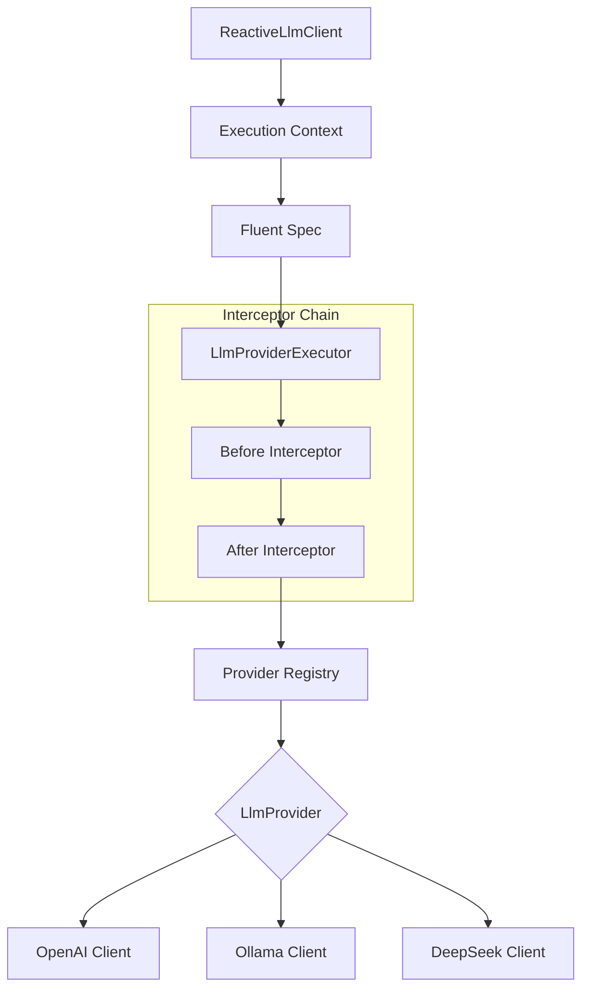

<div align="center">
  <h1 style="margin-top: 10px;">Reactive AI Lite</h1>

  <h2>High-performance, non-blocking Java client for LLMs with a Fluent API</h2>

  <div align="center">
    <a href="https://github.com/chenggangpro/reactive-ai-lite/blob/master/LICENSE"></a>
    <a href="https://www.oracle.com/java/technologies/javase/jdk21-archive-downloads.html"></a>
    <a href="https://spring.io/projects/spring-boot"></a>
  </div>

</div>

## Why Reactive AI Lite?

Reactive AI Lite is designed for modern, high-concurrency Java applications that need to integrate with Large Language Models without blocking threads.

- **⚡ Fully Reactive** - Built from the ground up on Project Reactor for non-blocking I/O.
- **🔌 Unified SPI** - One interface to rule them all: OpenAI, Ollama, DeepSeek, and more.
- **📜 Fluent DSL** - Build complex completion contexts with an intuitive, type-safe API.
- **🍃 Spring Native** - Seamless integration with Spring Boot 3.5+ via auto-configuration.
- **🔍 Observable** - Built-in interceptor chain for logging, monitoring, and debugging.

## Quick Start

### 1. Add Dependency

```xml
<dependency>
    <groupId>pro.chenggang</groupId>
    <artifactId>reactive-ai-lite-starter</artifactId>
    <version>0.1.0-SNAPSHOT</version>
</dependency>
```

### 2. Configure Credentials

```yaml
reactive:
  ai:
    lite:
      client:
        openai:
          chat-provider:
            token: ${OPENAI_API_KEY}
            is-default: true
```

### 3. Run Your First Request

```java
@Autowired
ReactiveLlmClient client;

// Simple non-blocking chat completion
client.chat()
    .newCompletionContext()
    .providerSpec().defaultProvider().defaultProfile()
    .chatSpec()
        .model(ctx -> "gpt-4o")
        .textMessage(ctx -> "How does non-blocking I/O work?")
    .general()
    .execute()
    .subscribe(response -> System.out.println(response.getTextContent()));
```

> **Prerequisites**: JDK 21+, Maven 3.9+, and a valid LLM API Key.

## Installation

### Environment Setup

```bash
# Clone the repository
git clone https://github.com/chenggangpro/reactive-ai-lite.git
cd reactive-ai-lite

# Build and install to local maven repository
mvn clean install -DskipTests
```

### Configuration

Configure multiple profiles and providers in your `application.yml`:

```yaml
reactive:
  ai:
    lite:
      client:
        enable-logging: true
        openai:
          chat-provider:
            baseUrl: https://api.openai.com
            certifications:
              - profile: default
                token: sk-...
                is-default: true
```

## Architecture

### System Overview

Reactive AI Lite uses a modular architecture that separates the API definition from provider implementations.



### Key Design Decisions

- **Immutability**: Execution contexts and request data are immutable to ensure thread safety in reactive pipelines.
- **Chain of Responsibility**: Interceptors handle cross-cutting concerns like logging and auth without polluting provider logic.
- **Provider SPI**: New LLM providers can be added by implementing the `LlmProvider` interface and registering them as beans.

## 🗂️ Repository Structure

Here is a breakdown of the repository and the purpose of each component:

```text
reactive-ai-lite/
├── reactive-ai-lite-core/               # The foundational module
│   ├── api/                             # Core client and module abstractions (e.g., ReactiveLlmClient)
│   ├── certification/                   # Authentication logic (Bearer tokens, URIs)
│   ├── entity/                          # Context and message entities used throughout the execution
│   ├── exception/                       # Custom exception hierarchy
│   ├── execution/                       # Execution engine handling general, streaming, and structured responses
│   ├── interceptor/                     # Chain-of-responsibility pattern for request/interception
│   ├── message/                         # Unified message abstraction (Text, Media, ToolCalls)
│   ├── provider/                        # Service Provider Interfaces (SPI) for LLMs
│   └── spec/                            # Fluent API configuration specifications
├── reactive-ai-lite-starter/            # Spring Boot integration module
│   ├── ReactiveAiLiteConfiguration.java # Auto-configuration beans
│   └── properties/                      # Type-safe property bindings (application.yml)
├── clients/                             # Concrete implementations for various LLM providers
│   ├── reactive-ai-lite-client-openai/  # OpenAI API client implementation
│   ├── reactive-ai-lite-client-ollama/  # Ollama API client implementation
│   └── reactive-ai-lite-client-deepseek/# DeepSeek API client implementation
├── pom.xml                              # Root Maven configuration
└── LICENSE                              # Apache 2.0 License file
```

## License

This project is licensed under the **Apache License 2.0** - see the [LICENSE](LICENSE) file for details.

## Contributors

| Name | Role | Contact |
|------|------|---------|
| **ChengGang** | Lead Developer | [chenggangpro@gmail.com](mailto:chenggangpro@gmail.com) |

---

<div align="center">
  <p>
    <strong>Built with ❤️ by ChengGang</strong><br>
    <sub>Modernizing AI integration for the Reactive Java ecosystem</sub>
  </p>
</div>
