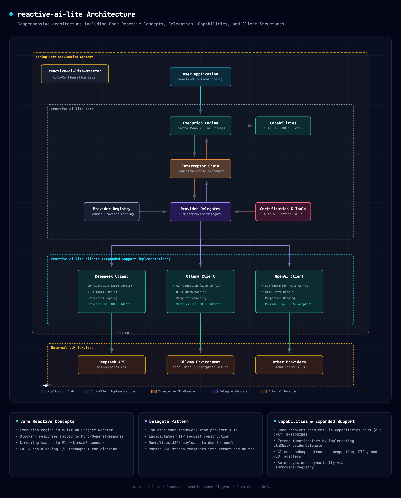

<div align="center">
  <h1 style="margin-top: 20px;">Reactive AI Lite</h1>
  <p><strong>High-Performance, Non-Blocking Java Client for Large Language Models</strong></p>

  <p>
    <a href="https://github.com/chenggangpro/reactive-ai-lite/blob/master/LICENSE"></a>
    <a href="https://www.oracle.com/java/technologies/javase/jdk21-archive-downloads.html"></a>
    <a href="https://spring.io/projects/spring-boot"></a>
    <a href="https://projectreactor.io/"></a>
  </p>
</div>

---

## 📖 Overview

**Reactive AI Lite** is an enterprise-grade, fully reactive Java library built from the ground up for integrating Large Language Models (LLMs) into high-concurrency, low-latency applications. 

Unlike traditional blocking HTTP clients that can lead to thread starvation during heavy LLM token streaming, this framework is engineered entirely on **Project Reactor** to provide a non-blocking, event-driven architecture. By utilizing a powerful **Delegate Pattern**, developers can effortlessly switch between AI providers using a highly readable, fluent builder DSL—all with zero thread-blocking overhead.

---

## ✨ Core Features

- **🚀 Fully Reactive Execution Pipeline**: End-to-end non-blocking I/O utilizing Project Reactor (`Mono` and `Flux`). Delivers thread-safe interactions with maximum concurrency and zero context-switching overhead.
- **🔌 Provider Agnostic & Unified Routing**: The core engine dynamically resolves handlers based on requested capabilities (`CHAT`, `EMBEDDING`, etc.). Swap providers without changing your core business logic.
- **🌊 Native Streaming (SSE)**: First-class support for Server-Sent Events (SSE) via `Flux` for real-time token generation and immediate UX feedback.
- **📜 Fluent Builder DSL**: Compose complex requests cleanly and type-safely using static values or dynamic context-aware lambdas.
- **🛡️ Interceptor Chain**: A robust `ExchangeInterceptor` aspect-oriented middleware chain for request/response manipulation, security, logging, and metrics.
- **🍃 Spring Boot Native**: The drop-in `reactive-ai-lite-starter` provides zero-friction auto-configuration for modern Spring Boot applications.

---

## 🏗 Architecture & Design

The library enforces strict separation of concerns through an SPI-based (Service Provider Interface) architecture:

1. **Execution Engine:** The central nervous system mapping blocking models to `Mono<GeneralResponse>` and streaming requests to `Flux<StreamResponse>`.
2. **Interceptor Middleware:** A Chain-of-Responsibility pattern that intercepts requests and responses (useful for auth, metrics, and logging).
3. **Provider Delegates:** The `LlmChatProviderDelegate` interface bridges the gap between the core framework and external provider REST APIs, handling payload normalization and stream parsing.
4. **Dynamic Registry:** The `LlmProviderRegistry` automatically resolves and loads the correct client implementations based on the requested capability.

<div align="center">
  
</div>

---

## 🌐 Supported Providers

Reactive AI Lite currently offers out-of-the-box support for the following providers via their respective client modules:

- **OpenAI** (`reactive-ai-lite-client-openai`)
- **Anthropic** (`reactive-ai-lite-client-anthropic`)
- **DeepSeek** (`reactive-ai-lite-client-deepseek`)
- **Ollama** (`reactive-ai-lite-client-ollama`) — Perfect for local and enterprise deployments.

*Implementing a proprietary model is as simple as extending the `LlmChatProviderDelegate` and registering it via the provider registry.*

---

## 🚀 Getting Started

### Prerequisites

- **Java 21** or higher
- **Maven 3.9+** (or Gradle equivalent)
- **Spring Boot 3.5.16+**

### 1. Installation

Include the core starter and your desired provider client in your application's `pom.xml`:

```xml
<dependencies>
    <!-- Core Spring Boot Starter -->
    <dependency>
        <groupId>pro.chenggang</groupId>
        <artifactId>reactive-ai-lite-starter</artifactId>
        <version>0.1.0-SNAPSHOT</version>
    </dependency>

    <!-- Provider Client (e.g., OpenAI) -->
    <dependency>
        <groupId>pro.chenggang</groupId>
        <artifactId>reactive-ai-lite-client-openai</artifactId>
        <version>0.1.0-SNAPSHOT</version>
    </dependency>
</dependencies>
```

### 2. Configuration

Set up your LLM API credentials and provider endpoints in your Spring Boot `application.yml` using the `reactive.ai.lite.client` prefix:

```yaml
reactive:
  ai:
    lite:
      client:
        enable-logging: true
        openai:
          base-url: https://api.openai.com
          certifications:
            - profile: default
              token: ${OPENAI_API_KEY}
              is-default: true
          chat:
            endpoint: /v1/chat/completions
            is-default: true
          embedding:
            endpoint: /v1/embeddings
            is-default: true
```

---

## 💡 Usage Examples

Inject `ReactiveLlmClient` into your Spring services to construct and execute non-blocking requests. Properties like `model`, `systemMessage`, or `textMessage` accept lambdas (`Function<executionContext, T>`) by default, allowing dynamic evaluation from the reactive pipeline context.

### Non-Blocking Chat (`Mono`)
Execute a standard request-response chat execution. The entire flow remains non-blocking.

```java
import org.springframework.beans.factory.annotation.Autowired;
import org.springframework.stereotype.Service;
import pro.chenggang.project.reactive.ai.lite.core.api.ReactiveLlmClient;
import reactor.core.publisher.Mono;

@Service
public class ChatService {

    @Autowired
    private ReactiveLlmClient llmClient;

    public Mono<String> askQuestion(String prompt) {
        return llmClient.chat()
            .model(executionContext -> "gpt-4o")
            .systemMessage(executionContext -> "You are a helpful assistant")
            .textMessage(executionContext -> prompt)
            .maxCompletionTokens(executionContext -> 1000)
            .general()
            .execute()
            .map(response -> response.getTextContent());
    }
}
```

### Real-Time Streaming Chat (`Flux`)
Handle real-time tokens dynamically using the streaming execution handler via Server-Sent Events (SSE).

```java
public Flux<String> streamAnswer(String prompt) {
    return llmClient.chat() 
        .model(executionContext -> "gpt-4o")
        .systemMessage(executionContext -> "You are a helpful assistant")
        .textMessage(executionContext -> prompt)
        .maxCompletionTokens(executionContext -> 1000)
        .stream()
        .execute()
        .mapNotNull(streamResponse -> {
            StreamDataChunk dataChunk = streamResponse.getDataChunk();
            if(ANSWER_CONTENT.equals(dataChunk.getDataType())){
                TextStreamDataChunk textStreamDataChunk = (TextStreamDataChunk) dataChunk;
                return textStreamDataChunk.getValue();
            }
            // ...
            return null;
        });
}
```

### Structured Output (`Mono`)
Enforce structured JSON responses mapped directly to a Java Class using `.structured()`.

```java
import org.springframework.core.ParameterizedTypeReference;

public Mono<ResultClass> askStructuredQuestion(String prompt) {
    return llmClient.chat()
        .model(executionContext -> "gpt-4o")
        .textMessage(executionContext -> prompt)
        .structured()
        .execute(new ParameterizedTypeReference<ResultClass>() {});
}
```

### Embeddings (`Mono`)
Generate dense vector representations for text inputs.

```java
public Mono<EmbeddingResponse> getEmbedding(String text) {
    return llmClient.embedding()
        .model(executionContext -> "text-embedding-3-small")
        .inputText(text)
        .general()
        .execute();
}
```

---

## 🗂️ Project Structure

The codebase is strictly compartmentalized into independent Maven modules to maintain clean dependency boundaries:

```text
reactive-ai-lite/
├── reactive-ai-lite-core/               # Core execution engine, capabilities, and SPI delegates
├── reactive-ai-lite-starter/            # Spring Boot auto-configuration & property bindings
├── clients/                             # Provider REST Adapters & DTOs
│   ├── reactive-ai-lite-client-anthropic/
│   ├── reactive-ai-lite-client-deepseek/
│   ├── reactive-ai-lite-client-ollama/
│   └── reactive-ai-lite-client-openai/
├── pom.xml                              # Aggregator POM
└── LICENSE                              # Apache 2.0 License
```

---

## 🛠️ Building from Source

To build this project locally, clone the repository and use Maven:

```bash
git clone https://github.com/chenggangpro/reactive-ai-lite.git
cd reactive-ai-lite
mvn clean install -DskipTests
```

---

## 📄 License

This library is open-sourced software licensed under the [Apache License 2.0](LICENSE).
