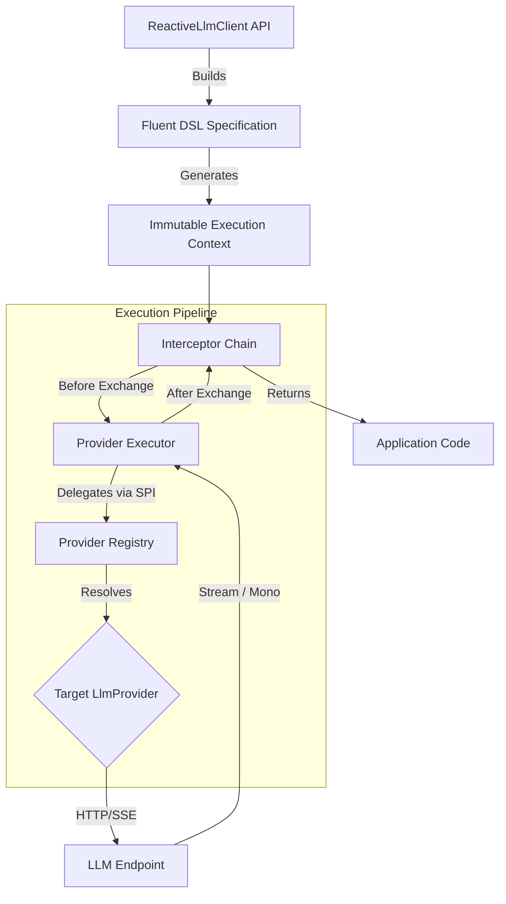

<div align="center">
  <h1 style="margin-top: 10px;">Reactive AI Lite</h1>

  <h2>High-Performance, Non-Blocking Java Client for Large Language Models</h2>

  <div align="center">
    <a href="https://github.com/chenggangpro/reactive-ai-lite/blob/master/LICENSE"></a>
    <a href="https://www.oracle.com/java/technologies/javase/jdk21-archive-downloads.html"></a>
    <a href="https://spring.io/projects/spring-boot"></a>
    <a href="https://projectreactor.io/"></a>
  </div>

</div>

## Overview

**Reactive AI Lite** is a modern, reactive Java library designed to integrate Large Language Models (LLMs) into high-concurrency, low-latency applications. Built entirely on **Project Reactor**, it provides a non-blocking, event-driven architecture that ensures optimal resource utilization under heavy load.

By abstracting provider-specific implementations behind a unified **Service Provider Interface (SPI)**, Reactive AI Lite enables developers to write provider-agnostic code using a highly readable, type-safe fluent DSL.

### Core Capabilities

- **🚀 Fully Reactive Architecture**: End-to-end non-blocking I/O leveraging `Mono` and `Flux`, ensuring thread-safe operations without context-switching overhead.
- **🔌 Unified Provider SPI**: A single, elegant API to interact with diverse model providers including **OpenAI**, **Anthropic**, **DeepSeek**, and **Ollama**.
- **📜 Fluent Builder DSL**: Construct complex chat completion requests, including system prompts, multi-modal inputs, and tool calls, with an intuitive and type-safe API.
- **🌊 Native Streaming Support**: First-class support for Server-Sent Events (SSE) streaming via `Flux`, enabling real-time generation and chunk processing.
- **🍃 Spring Boot 3.5+ Integration**: Zero-friction auto-configuration with `reactive-ai-lite-starter`, seamlessly integrating with the Spring ecosystem.
- **🔍 Interceptor Chain**: An aspect-oriented execution pipeline for observability, request logging, caching, and security enforcement without polluting core business logic.

---

## Getting Started

### 1. Add Dependencies

Add the core starter and the desired provider client to your `pom.xml`:

```xml
<dependencies>
    <!-- Core Spring Boot Starter -->
    <dependency>
        <groupId>pro.chenggang</groupId>
        <artifactId>reactive-ai-lite-starter</artifactId>
        <version>0.1.0-SNAPSHOT</version>
    </dependency>

    <!-- Provider Client (e.g., OpenAI) -->
    <dependency>
        <groupId>pro.chenggang</groupId>
        <artifactId>reactive-ai-lite-client-openai</artifactId>
        <version>0.1.0-SNAPSHOT</version>
    </dependency>
</dependencies>
```

### 2. Configure Properties

Configure your LLM credentials and provider settings in `application.yml`:

```yaml
reactive:
  ai:
    lite:
      client:
        enable-logging: true
        openai:
          chat-provider:
            baseUrl: https://api.openai.com
            certifications:
              - profile: default
                token: ${OPENAI_API_KEY}
                is-default: true
```

### 3. Basic Usage (Mono)

Execute a standard, non-blocking chat completion request:

```java
@Autowired
private ReactiveLlmClient llmClient;

public Mono<String> askQuestion(String question) {
    return llmClient.chat()
        .newCompletionContext()
        .providerSpec().defaultProvider().defaultProfile()
        .chatSpec()
            .model(ctx -> "gpt-4o")
            .textMessage(ctx -> question)
        .general()
        .execute()
        .map(response -> response.getTextContent());
}
```

### 4. Streaming Output (Flux)

Handle real-time tokens using the streaming execution mode:

```java
public Flux<String> streamAnswer(String question) {
    return llmClient.chat()
        .newCompletionContext()
        .providerSpec().defaultProvider().defaultProfile()
        .chatSpec()
            .model(ctx -> "gpt-4o")
            .textMessage(ctx -> question)
        .stream()
        .execute()
        .map(chunk -> chunk.getTextContent());
}
```

---

## Architectural Design

Reactive AI Lite is designed with modularity, immutability, and extensibility at its core.

### Request Lifecycle

1. **Fluent Spec Construction**: Developers use the DSL to build an immutable `ExecutionContextSpec`.
2. **Context Instantiation**: The Spec resolves into an immutable `ExecutionContext` containing configurations, messages, and target provider details.
3. **Interceptor Pipeline**: The request traverses a Chain-of-Responsibility composed of `ExchangeInterceptor` implementations (e.g., Logging, Authentication).
4. **Provider SPI Execution**: The `LlmProviderExecutor` delegates the contextual request to the mapped `LlmProvider` (e.g., OpenAI, Ollama).
5. **Reactive Response**: The provider executes the network call non-blockingly and returns a `Mono` or `Flux` encompassing the LLM response.




### Extensibility: Implementing a Custom Provider

The SPI design allows seamless integration of custom or proprietary LLMs without altering the core framework. Simply implement the `LlmProvider` interface and expose it as a Spring Bean:

```java
@Component
public class CustomLlmProvider implements LlmProvider {

    @Override
    public String providerName() {
        return "custom-provider";
    }

    @Override
    public Mono<ChatCompletionResponse> chatCompletion(ExecutionContext context) {
        // Implement reactive HTTP call to the proprietary LLM
    }
    
    @Override
    public Flux<ChatCompletionChunk> streamChatCompletion(ExecutionContext context) {
        // Implement reactive SSE stream parsing
    }
}
```

---

## 🗂️ Project Structure

The repository is modularized to maintain strict separation of concerns:

```text
reactive-ai-lite/
├── reactive-ai-lite-core/               # Foundational interfaces, SPIs, and the execution engine
│   ├── api/                             # Entry points (ReactiveLlmClient, ChatModule)
│   ├── entity/                          # Immutable request/response contexts and data structures
│   ├── execution/                       # Execution strategies (General vs Streaming)
│   ├── interceptor/                     # Chain-of-responsibility aspect framework
│   └── provider/                        # LlmProvider Service Provider Interface
├── reactive-ai-lite-starter/            # Spring Boot autoconfiguration and properties
├── clients/                             # Official LlmProvider implementations
│   ├── reactive-ai-lite-client-anthropic/
│   ├── reactive-ai-lite-client-deepseek/
│   ├── reactive-ai-lite-client-ollama/
│   └── reactive-ai-lite-client-openai/
├── pom.xml                              # Maven root aggregation
└── LICENSE                              # Apache 2.0 License
```

> **Note:** The `openspec` and `ai-workspace` directories are excluded from this overview.

---

## Building from Source

Ensure you have **JDK 21+** and **Maven 3.9+** installed.

```bash
# Clone the repository
git clone https://github.com/chenggangpro/reactive-ai-lite.git
cd reactive-ai-lite

# Build the project, skipping tests
mvn clean install -DskipTests
```

## License

This project is open-sourced software licensed under the **Apache License 2.0**. See the [LICENSE](LICENSE) file for more information.